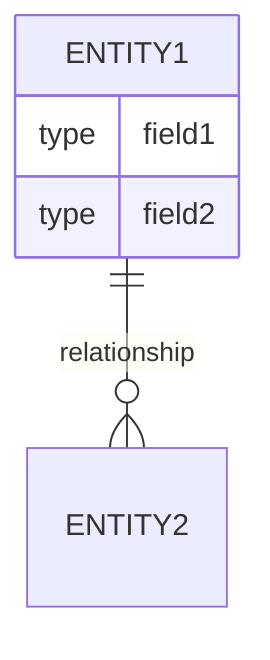
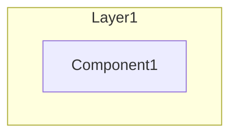

# 07 - Diagrams

## Purpose
Create Mermaid diagrams visualizing architecture, data models, and flows.

## Sub-agent Team
- **Diagrammer**: Creates visual documentation

## Input Requirements
- Completed architecture analysis
- Completed data models analysis
- Completed UI/UX analysis

## Output Artifacts
- `diagrams/erd.mmd` - Entity Relationship Diagram
- `diagrams/data_flow.mmd` - Data flow diagram
- `diagrams/user_flows.mmd` - Key user flows
- `diagrams/architecture.mmd` - System architecture
- `diagrams/component_map.mmd` - Component hierarchy

## Quality Gates
- [ ] All diagrams use valid Mermaid syntax
- [ ] Diagrams reference only verified entities/components
- [ ] No placeholder names
- [ ] Diagrams are readable (not too complex)

## Evidence Requirements
- Entity names from data_models analysis
- Component names from UI analysis
- Service names from architecture analysis

## Diagram Templates

### ERD Template

### Architecture Template

